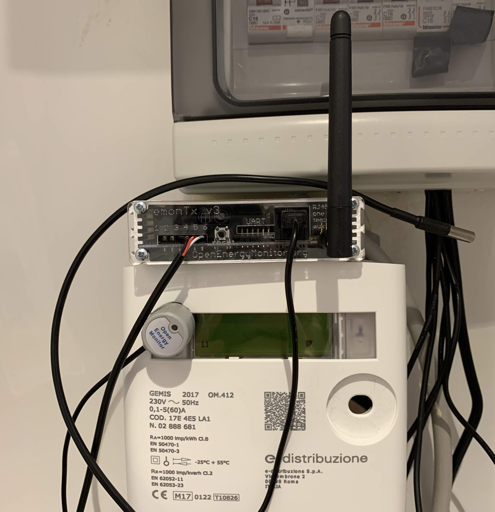

# Configurazione del sensore emonTx

Il sistema EmonTx permette il monitoriaggio dei propri consumi elettrici attraverso il conteggio degli impulsi ottici del comune contatore elettrico domestico, non richiede pertanto l'apertura del quadro elettrico e la manipolazione dei cavi, non necessita di configurazioni complesse per il conferimento delle misurazioni al database dell'Edge, ed è alimentato tramite pile stilo, pertanto non richiede l'installazione di prese dedicate.

I sensori dell'EmonTx sono rappresentati da una fotocellula per il conteggio dei pulse e da una sonda per la misurazione della temperatura ambientale.

La figura seguente mostra l'installazione del dispositivo su un normale contatore domestico.

## Procedura passo passo

### 1. Aprire l'emonTx

1. Smontare il pannello dal lato del connettore dell'antenna;
2. Sfilare la scheda.

### 2. Installare la sonda di temperatura

La sonda va collegata alla morsettiera coi pin numerati da 1 a 6.

1. Passare il cavo della sonda attraverso il foro del pannello esterno
   corrispondenza della morsettiera;
2. Collegare i cavi della sonda alla morsettiera come specificato nella
   seguente tabella:

Morsetto  | Sonda
--------- | ---------------
3 (GND) 	| Nero (GND)
5 (Dig19) | Rosso (Power)
6 (Dig5) 	| Bianco (Data)

### 3. Installare pile

Inserire le pile nell'apposita sede sulla scheda.

### 4. Chiudere l'emonTx

Infilare la scheda nella sua sede, collocare il coperchio e fissare con le
viti, evitando di stringere troppo.

### 5. Installare l'antenna

L'antenna di trasmissione va avvitata all'apposito connettore filettato.

### 6. Collegare la fotocellula

La fotocellula si collega alla porta RJ-45.

### 7. Collocare in sede

A questo punto, l'emonTx è pronto per monitorare il flusso di energia
misurato dal contatore.  Monitoreremo i consumi attraverso le pulsazioni
della luce indicatrice del contatore.

**La luce da monitorare è tipicalmente quella in alto alla sinistra del display;** lampeggia di rosso.  Oggi pulso di questa luce indica il consumo di 1 Wh di
energia.

1. Attaccare il cerchio in velcro autoadesivo al contatore sopra la lucina da
   monitorare, assicurandosi che la lucina sia visibile attraverso il foto
  centrale.
2. Installare la fotocellula collegata all'emonTx sul velcro.

L'emonTx andrà poggiato da qualche parte -- e.g., sul contatore, o in fondo
all'armadietto, oppure fissato con del velcro in modo che possa essere
facilmente estratto per sostituire le pile.

### 8. Finito!

## Guida dettagliata

Guide dettagliate all'emonTx sono disponibili da openenergymonitor.org:
* <https://wiki.openenergymonitor.org/index.php/EmonTx_V3.4>;
* <https://guide.openenergymonitor.org/technical/emontx/>.
